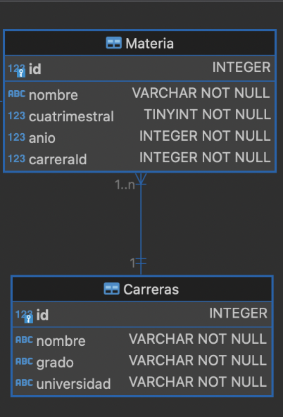

# TP - Laboratorio de programación y Lenguaje 2024
### Grupo **"Code of Duty"**

### Integrantes:
```
• Alvez Sofia
• Maldonado Ignacio
• Mentoro Facundo
• Romero Sergio
```

## Guia de Instalación:

### Opcion 1 - Clonacion de Repositorio (HTTPS).  

Desde la terminal Git Bash ir al directorio donde se desea clonar el proyecto. Escribir el siguiente comando para clonar el repositorio

```git clone https://github.com/Veik1/TP-LPyL-CoD.git```

###  Opcion 2 - Descarga de Repositorio.

Desde el boton <**Code**> elegir la opcion Download ZIP para descargar el repositorio. Descomprimirlo en el directorio donde se va a deplegar el proyecto

Una vez que se tenga el proyecto en el directorio deseado, en un Simbolo de Sistema (CMD) ir hasta el proyecto y abrir VSCode (code .)

## Intalacion de Dependencias e Inicio del Proyecto
En una terminal dentro de VSCode, correr el siguiente comando para intalar todas las dependencias necesarias para iniciar correctamente el proyecto

	npm install
 
Luego que se intalen todas las dependecncias, para iniciar el servidor del proyecto correr el siguiente comando:

	npm run dev


## Uso y Pruebas en Postman
Una vez intalado y ya corriendo el proyecto en el entorno local:

- Abrir Postman

- Ir al botón ubicado la parte superior izquierda de Postman, y seleccionar **File>Import**...

- Buscar el archivo ya descargado **“CRUD Testing.postman_collection”** dentro del proyecto para arrastrarlo o poder seleccionarlo desde **Choose Files**

- Haga click en **Import** para tener el archivo importado

## El proyecto posee esta estructura:




## Los resultados de las pruebas deben ser los siguientes: 

|Verbo|Recurso|Status code|Descripción|
|-----|-------|-----------|-----------|
|POST|/carreras|201, 400, 500|Crear una Carrera|
|GET|/carreras|200, 500|Obtener todas la carreras|
|GET|/carreras/:id|200, 404, 500|Obtener una carrera en particular|
|PUT|/carreras/:id|200, 404, 500|Modificar una carrera en particular|
|DELETE|/carreras/:id|200, 404, 500|Borra una carrera en particular|
|POST|/carreras/:id/materia|201, 404, 400, 500|Crea un materia dentro de una carrera|
|GET|/carreras/:id/materias|200, 404, 500| Obtener todas la materias de una Carrera
|GET|/materias|200, 500|Obtener todas las materias|
|GET|/materias/:id|200, 404, 500|Obtener una materia en particular|
|PUT|/materias/:id|200, 404, 500|Modificar una materia en particular|
|DELETE|/materias/:id|200, 404, 500|Borra una materia en particular|
